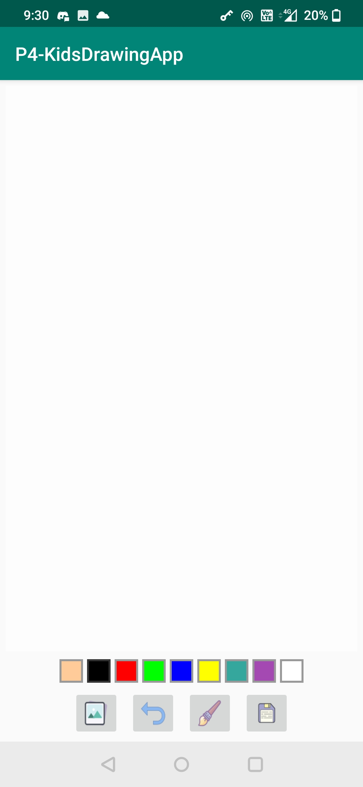
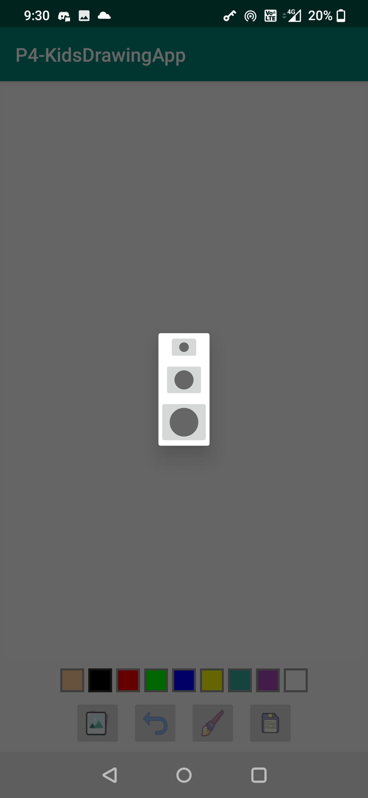
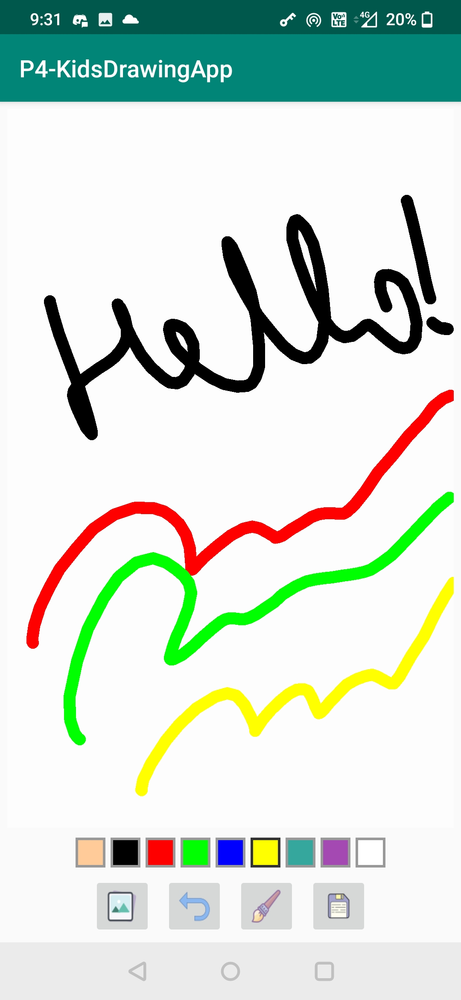
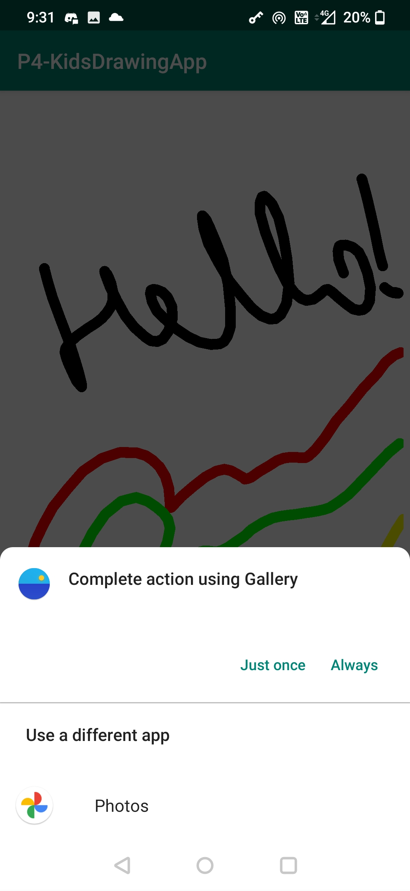
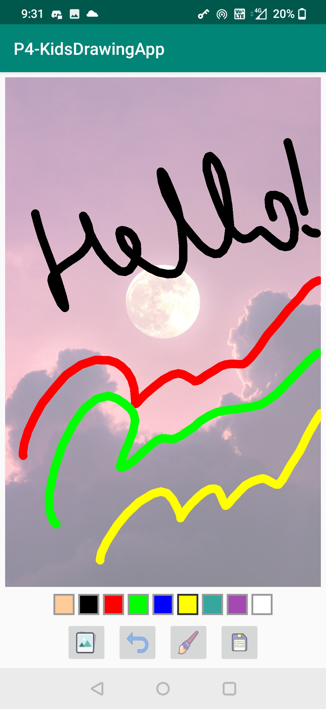
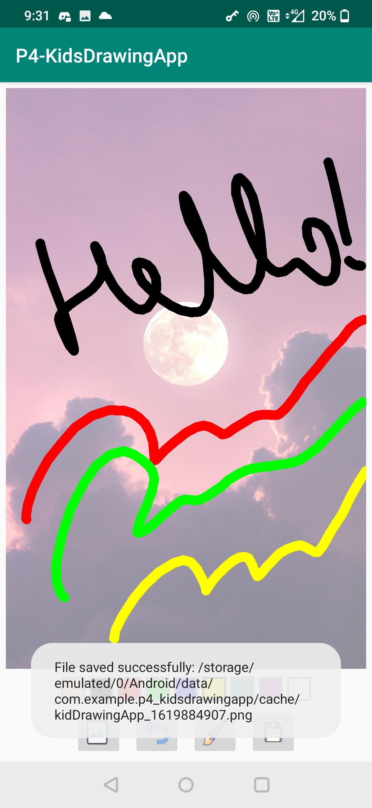

# Udemy Project: Kids Drawing App

This is a hands-on project from the Udemy course - [The Complete Android 10 & Kotlin Development Masterclass](https://www.udemy.com/course/android-kotlin-developer/) by Denis Punjeta.

# Demo

  
  

  
  

  
  

 
